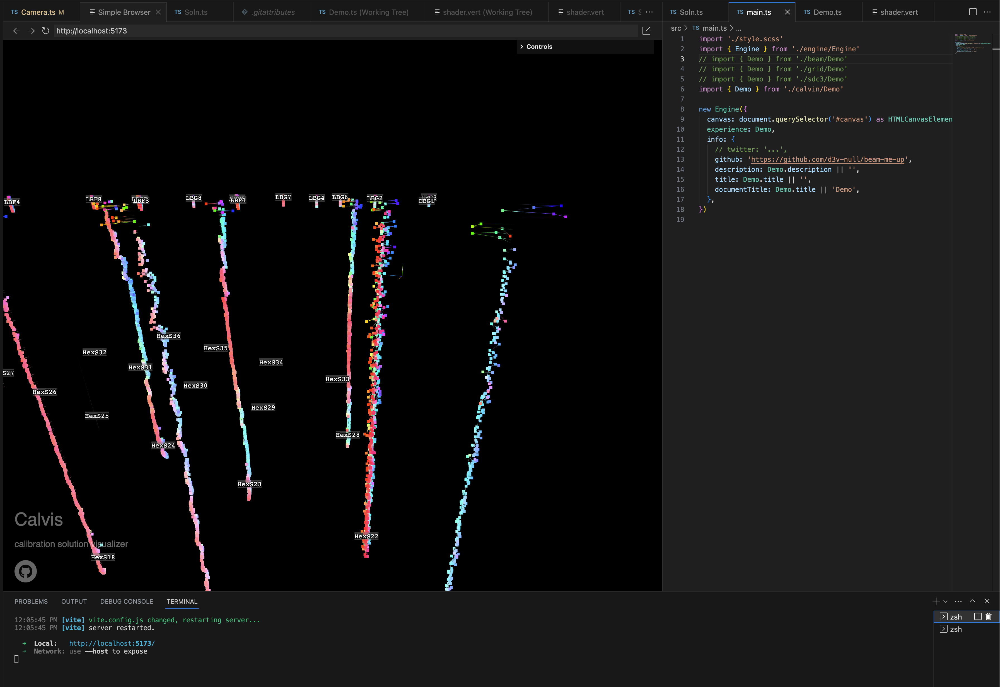

# Beam Me Up

A few simple Three.js + TypeScript + Vite demos based on <https://github.com/mayacoda/simple-threejs-typescript-starter>




you can switch between demos by modifying the comments in main.ts

## Prerequisites

- [Node.js](https://nodejs.org)
- [yarn](https://yarnpkg.com) OR [npm](https://www.npmjs.com)

> 💡 This project uses **yarn@3.2.1** and **npm@8.1.2**. Other versions might lead to different package resolutions, proceed with caution. Example commands use **yarn**.

## Development

The starter includes a pre-configured Vite server which you can use to run and develop your project. To start the development server, run the following command:

```bash
yarn dev
```

To build the project, run:

```bash
yarn build
```

And if you wish to automatically start a server to preview your build, you can run:

```bash
yarn build && yarn preview
```